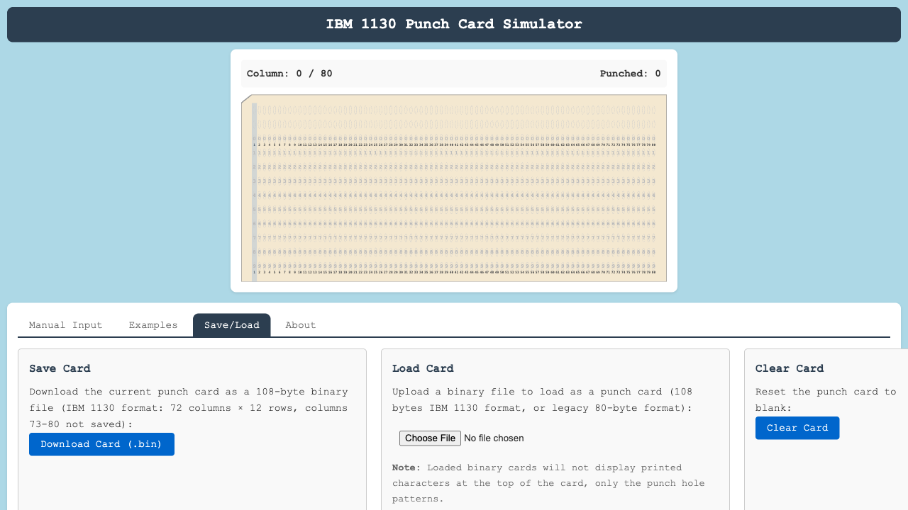

# IBM 1130 Punch Card Simulator

An interactive web-based IBM 1130 punch card simulator built with Yew (Rust/WASM). Experience the authentic process of punching cards with Hollerith encoding, just like the IBM 029 keypunch era.



*Interactive demo showing an IBM 1130 assembler source card with Hollerith punch patterns*

**[Try the Live Demo →](https://wrightmikea.github.io/punch-card/)**

## Features

### Current (MVP)
- ✅ **Interactive Punch Card Display** - SVG-based 80-column card with authentic cream color
- ✅ **Hollerith Encoding** - Complete IBM 029 character set (64 characters)
- ✅ **EBCDIC Support** - Save/load cards in 80-byte EBCDIC format
- ✅ **Character Printing** - Characters printed at top of card (IBM 029 feature)
- ✅ **Pre-printed Digits** - Authentic 0-9 row markers in light gray
- ✅ **Column Index Rows** - Small font index rows between 0/1 and 9/bottom
- ✅ **Real-time Punching** - See holes appear as you type
- ✅ **Column Highlighting** - Visual indicator of current column
- ✅ **Corner Cut** - Transparent corner cut matching authentic cards
- ✅ **Centered Display** - Card centered with light blue margins
- ✅ **IBM 1130 Examples** - Load sample assembler source and object deck code
- ✅ **Text Mode** - Type up to 80 characters
- ✅ **Binary Mode** - Object deck format with authentic 4:3 punch pattern
- ✅ **Test-Driven Development** - 49 passing unit tests for core library (100% pass rate)
- ✅ **GitHub Pages Deployment** - Live demo available at [wrightmikea.github.io/punch-card](https://wrightmikea.github.io/punch-card/)

### Planned Features
- 🔄 Additional Examples - More IBM 1130 code samples
- 🔄 CLI Server - Serve app on configurable port

## Technology Stack

- **Rust 2024 Edition** - Modern, safe systems programming
- **Yew 0.21** - React-like framework for Rust/WASM
- **Trunk** - WASM web application bundler
- **Hollerith Encoding** - Authentic IBM punch card format
- **SVG Graphics** - Scalable, crisp punch card rendering

## Quick Start

### Prerequisites
- Rust (latest stable)
- Trunk: `cargo install trunk`
- wasm32 target: `rustup target add wasm32-unknown-unknown`

### Development

```bash
# Clone the repository
git clone https://github.com/wrightmikea/punch-card.git
cd punch-card

# Build and serve the web app (development mode)
cd crates/web
trunk serve

# Open browser to http://127.0.0.1:8080
```

### Production Build

```bash
# Build optimized WASM bundle (outputs to docs/ for GitHub Pages)
cd crates/web
trunk build --release

# Serve the docs directory locally to test
cd ../../docs
python3 -m http.server 9267

# Open browser to http://localhost:9267/punch-card/
```

### Running Tests

```bash
# Run core library tests (49 tests)
cargo test --package punch-card-core

# All tests should pass with 100% success rate
```

## Project Structure

```
punch-card/
├── crates/
│   ├── core/           # Core Rust library
│   │   ├── hollerith.rs    # Hollerith encoding (26 tests)
│   │   ├── ebcdic.rs       # EBCDIC encoding (6 tests)
│   │   ├── punch_card.rs   # Card data structures (13 tests)
│   │   ├── ibm1130.rs      # IBM 1130 formats (4 tests)
│   │   └── lib.rs          # Module exports
│   ├── web/            # Yew WASM application
│   │   ├── components/     # React-like components
│   │   │   ├── app.rs          # Main app
│   │   │   ├── punch_card.rs   # SVG card display
│   │   │   ├── text_input.rs   # Input component
│   │   │   └── tabs.rs         # Tab components
│   │   ├── index.html      # HTML entry point
│   │   └── styles.css      # Application styles
│   └── cli/            # CLI server (planned)
├── docs/               # GitHub Pages build output
├── notes/
│   ├── implementation.md   # Detailed documentation
│   ├── research.txt        # Research notes
│   └── chat.txt            # Development chat logs
├── images/
│   ├── screenshot.png      # Application screenshot
│   └── punchcard.png       # Reference image
├── LICENSE                 # MIT License
└── README.md               # This file
```

## How It Works

### Hollerith Encoding

The simulator uses authentic Hollerith punch card encoding as implemented in the IBM 029 keypunch:

- **12 rows per column**: 12, 11, 0-9
- **80 columns**: Standard punch card format
- **Zone punches**: Rows 12, 11, 0 for letters and special characters
- **Numeric punches**: Rows 1-9 for digits

Example encodings:
- `'A'` = rows 12, 1
- `'5'` = row 5
- `'.'` = rows 12, 3, 8 (period with 8-punch)

### IBM 1130 Format

The example assembler source card follows IBM 1130 conventions:
- Columns 1-5: Label field
- Column 6: Continuation indicator
- Columns 7-10: Operation code
- Columns 11-80: Operands and comments

## Usage

### Basic Operation

1. **Type Text**: Enter up to 80 characters in the input field
2. **Watch It Punch**: See the card update in real-time with Hollerith encoding
3. **Load Examples**: Click "Assembler Source Card" or "Object Deck Card" to see IBM 1130 formats
4. **Save/Load**: Download cards as 80-byte EBCDIC files or upload previously saved cards
5. **Clear Card**: Click "Clear Card" to reset and start over

### Character Support

Supports the full IBM 029 character set:
- **Letters**: A-Z
- **Digits**: 0-9
- **Special**: `& - / . < ( + | ! $ * ) ; , % _ > ? : # @ ' = "`
- **Space**: Blank (no punches)

Text is automatically converted to uppercase (authentic keypunch behavior).

## Educational Purpose

This simulator is designed for:

- **Computer History Education** - Understanding punch card technology
- **IBM 1130 Study** - Learning about 1960s-era computing
- **Hollerith Encoding** - Visualizing character encoding
- **Retro Computing** - Experiencing vintage workflows

## Development Approach

This project follows **Test-Driven Development (TDD)**:

1. Write tests first (Red)
2. Implement functionality (Green)
3. Refactor for quality

**Test Coverage:**
- Hollerith encoding: 26 tests
- EBCDIC encoding: 6 tests
- Punch card operations: 13 tests
- IBM 1130 formats: 4 tests
- **Total: 49 passing tests (100% pass rate)**

## Documentation

Comprehensive documentation is available:

- **[Implementation Guide](./notes/implementation.md)** - Architecture, design, and development plan
- **Code Comments** - Inline documentation throughout
- **Test Examples** - 43 tests demonstrating usage

## Browser Compatibility

Requires WebAssembly support:
- Chrome/Edge 88+
- Firefox 89+
- Safari 15+

## Future Enhancements

See [notes/implementation.md](./notes/implementation.md) for the complete roadmap:

- CLI server with port configuration
- Additional IBM 1130 examples
- Mobile responsive design improvements
- Print functionality
- Card deck management (multiple cards)

## Contributing

Contributions welcome! This is an educational project focused on preserving computing history.

1. Fork the repository
2. Create a feature branch
3. Write tests first (TDD approach)
4. Implement your feature
5. Submit a pull request

## License

MIT License - See LICENSE file for details

## Author

**Michael A Wright**

## Acknowledgments

- Inspired by IBM 029 keypunch machines from the 1960s-70s
- Based on authentic Hollerith punch card encoding
- Built to preserve and teach computer history
- Reference projects: toggle-nixie, knob-lamps

## References

- [IBM 029 Card Punch History](https://twobithistory.org/2018/06/23/ibm-029-card-punch.html)
- [Doug Jones's Punched Card Codes](https://homepage.divms.uiowa.edu/~jones/cards/codes.html)
- [IBM 1130 Wikipedia](https://en.wikipedia.org/wiki/IBM_1130)
- [IBM 1130 Binary Card Format](https://dialectrix.com/G4G/ZebraStripeCard.html)

---

**Built with Rust, Yew, and a passion for computing history**
